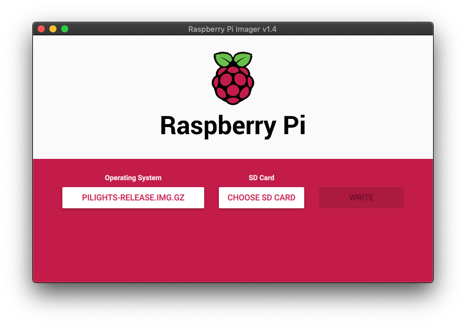

# pilights operating system

This repository contains the operating system image used for light controllers. Specifically the light boxes designed and built by Jamie Rohrer.

## Getting Started

1. Download the [latest pilights release]().
2. Download [Raspberry Pi Imager]().
3. Open Raspberry Pi Imager, select the pilights image ('Use custom' menu option) and select your microSD card.
4. Click 'Write'. Process takes about 10 minutes to complete.
5. Boot up your Raspberry Pi 4 using your freshly imaged microSD card.

Upon initial bootup, the lighbox will enter a diagnostics mode. This will do a quick run-through each outlet channel, lighting up and turning off every 10 seconds one after another. Power cycle the Pi when ready; This will put the lighbox into production mode.

## Registering New Devices for East Troy Lights

When you power up your lightbox and it can successfully reach the internet, it will send out a pulse, notifying East Troy Lights staff of your lightbox IP address and serial number. We manually enter serial numbers into our system and once registered, your lightbox will then be connected and visible within the lightbox network. There may be some delay from turning on your lightbox and having it registered.

## For the hackers out there

This is a modified copy of the Raspberry Pi OS. It's modifed to:

- Continuously check for network status and if offline, it reboots itself.
- Sends IP addresses (Wifi, Wired, and Public) to East Troy Lights staff on each boot.
- Downloads the latest lightbox software that builds and runs on each boot.
- System optimizations to increase performance and improve bootup time.
